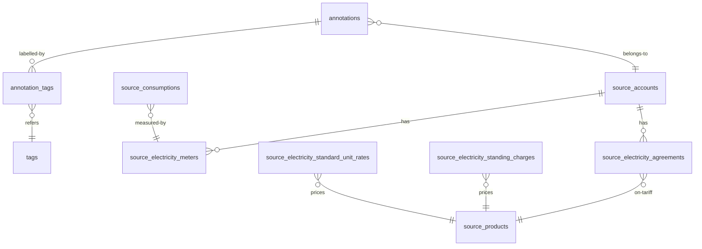

# Setrum — System Architecture

> A Plotly Dash app on top of a SQLite ELT pipeline that ingests Octopus
> Energy half-hourly meter data. Single-user, laptop-only.

---

## 1. Tech stack at a glance

| Layer | Choice | Why |
|---|---|---|
| **Language** | Python 3.13 | Modern typing, good pandas/SQLite story |
| **Package manager** | `uv` | Fast, lockfile-based, single-binary |
| **Database** | SQLite (WAL mode, FK on) | Zero-config, file-per-laptop, fits the data |
| **Web framework** | Dash 4.1 (Flask under the hood) | Python-only stack with reactive callbacks |
| **UI components** | dash-bootstrap-components 2.0 | Nice defaults; we use Flatly theme |
| **Charts** | Plotly Graph Objects (`go.Figure`) | First-class Dash integration; rich interactivity |
| **HTTP** | `requests` | Simple, blocking; we wrap with `ThreadPoolExecutor` |
| **Background callbacks** | `DiskcacheManager` + `multiprocess` | Backed by `./.cache/`, no Redis needed |
| **`.env` loading** | `python-dotenv` | Loads `OCTOPUS_API_KEY` and `OCTOPUS_ACCOUNT_NUMBER` |

**Critical macOS gotcha:** `multiprocess` defaults to `fork` start method
on Unix, but on macOS + Python 3.13 forked workers exit immediately as
zombies. **`dash_app/app.py` calls `multiprocess.set_start_method("spawn",
force=True)` before constructing `DiskcacheManager`.** Without this, the
Refresh button silently does nothing.

---

## 2. Repository layout

```
setrum/
├── core/                              # Data plane — pure Python, no Dash
│   ├── database.py                    # SQLite connection + schema + UPSERT
│   ├── fetchers.py                    # Octopus API client (chunked, threaded)
│   ├── orchestrator.py                # auto_catch_up() — top-level sync
│   ├── transformations.py             # ELT SQL models (analytics_fct_*)
│   ├── queries.py                     # Low-level helpers (job state, meters)
│   └── services/                      # The only API the UI calls
│       ├── annotations.py             # CRUD + position + aggregates
│       ├── consumption.py             # bounded reads + summary metrics
│       ├── sync.py                    # façade over orchestrator + status
│       └── tags.py                    # tags + tag-based analytics
│
├── dash_app/                          # UI plane
│   ├── app.py                         # Dash() instance + DiskcacheManager
│   ├── layout.py                      # Top-level shell (header/sidebar/main)
│   ├── stores.py                      # dcc.Store ID constants
│   ├── components/                    # Layout-level building blocks
│   │   ├── header.py                  # brand + tab nav
│   │   ├── sidebar.py                 # data status + refresh button
│   │   ├── annotation_form.py         # chart-bound floating form
│   │   ├── annotation_manager_form.py # manual create/edit modal
│   │   ├── annotations_board.py       # sticky-note canvas rendering
│   │   ├── daily_cost_chart.py        # daily area chart (£ + kWh views)
│   │   ├── hh_chart.py                # half-hourly bar chart
│   │   ├── summary_cards.py           # 4 KPI cards
│   │   ├── date_range_filter.py       # preset dropdown + custom picker
│   │   ├── annotation_format.py       # shared period / hover formatters
│   │   └── tabs/                      # Per-tab content modules
│   │       ├── consumptions_tab.py
│   │       ├── annotations_tab.py
│   │       └── insights_tab.py
│   │
│   ├── callbacks/                     # All @callback decorators
│   │   ├── annotations.py             # save + render board
│   │   ├── annotation_manager.py      # modal open/save/delete logic
│   │   ├── boot.py                    # ACTIVE_ACCOUNT_ID + data caption
│   │   ├── canvas.py                  # persist sticky positions
│   │   ├── charts.py                  # render daily + hh figures
│   │   ├── date_filters.py            # preset → resolved-range
│   │   ├── selection.py               # brush capture + form prefill
│   │   ├── summary.py                 # KPI cards
│   │   ├── sync.py                    # background refresh
│   │   └── tab_router.py              # active_tab → main-content
│   │
│   └── assets/                        # Auto-loaded by Dash
│       ├── setrum.css                 # All custom styling
│       └── canvas_drag.js             # Sticky note drag handler
│
├── run.py                             # `uv run python run.py`
├── pyproject.toml
├── uv.lock
├── setrum.db                          # SQLite (gitignored locally)
├── .cache/                            # Diskcache for background callbacks
└── .env                               # OCTOPUS_API_KEY, OCTOPUS_ACCOUNT_NUMBER
```

---

## 3. High-level architecture

```
┌──────────────────────────────────────────────────────────────────────┐
│                          Browser (the UI)                            │
│   Dash JS bundle  ←  WebSocket-ish polling  →  Flask /Dash routes   │
└──────────────────────────────────┬───────────────────────────────────┘
                                   │  HTTP, JSON callback round-trips
                                   ▼
┌──────────────────────────────────────────────────────────────────────┐
│                         Dash Python process                          │
│                                                                      │
│   layout.py ─────  layout tree (rendered once on app start)          │
│        │                                                             │
│        ▼                                                             │
│   ┌─────────────────────────────────────────────────────────┐       │
│   │                callbacks/*.py                            │       │
│   │   @callback(Output, Input, State, ...)                   │       │
│   │   read services  →  return new component props           │       │
│   └────────────────────────────┬─────────────────────────────┘       │
│                                │                                     │
│                                ▼                                     │
│   ┌─────────────────────────────────────────────────────────┐       │
│   │              core/services/*.py                          │       │
│   │   The ONLY API the UI calls. No raw SQL in callbacks.    │       │
│   └────────────────────────────┬─────────────────────────────┘       │
│                                │                                     │
│             ┌──────────────────┴───────────────────┐                 │
│             ▼                                      ▼                 │
│   ┌──────────────────┐               ┌────────────────────────┐     │
│   │  core/queries.py │               │  core/orchestrator.py  │     │
│   │     (raw SQL)    │               │  (sync + transforms)   │     │
│   └────────┬─────────┘               └────────────┬───────────┘     │
│            │                                      │                 │
│            └──────────────┬───────────────────────┘                 │
│                           ▼                                          │
│                ┌──────────────────────┐                              │
│                │  core/database.py    │                              │
│                │  (SQLite connection) │                              │
│                └──────────┬───────────┘                              │
└───────────────────────────┼──────────────────────────────────────────┘
                            ▼
                    ┌─────────────────┐
                    │   setrum.db     │
                    │  (SQLite, WAL)  │
                    └─────────────────┘

                            ▲
                            │ writes
                            │
   ┌────────────────────────┴────────────────────────┐
   │            Background sync subprocess            │
   │   (multiprocess.spawn — see §6)                  │
   │                                                  │
   │   core/orchestrator.auto_catch_up()              │
   │           │                                      │
   │           ├── core/fetchers.py  →  Octopus API   │
   │           └── core/transformations.MODELS  ──┐   │
   │                                              ▼   │
   │                                    SQLite UPSERT │
   └──────────────────────────────────────────────────┘
```

The architectural rule: **callbacks call services, services call queries
or orchestrator, no direct SQL above the service layer.**

---

## 4. Data plane

### 4.1 Database schema



**Source tables** (raw API data, append-only, UPSERT-keyed):

- `source_consumptions(interval_start, mpan, meter_serial_number, …, consumption_kwh)`
- `source_electricity_standard_unit_rates(interval_start, tariff_code, …, value_inc_vat, value_exc_vat)`
- `source_electricity_standing_charges(...)` (same shape as unit rates)
- `source_accounts`, `source_electricity_meters`, `source_electricity_agreements`, `source_products`
- `job_runs(endpoint_name PK, status, last_successful_timestamp, last_run_at, error_message)`

**Analytics tables** (drop-and-rebuild via `core/transformations.MODELS`):

- `analytics_fct_consumptions_half_hourly` — joins consumption × tariff × agreement; one row per HH bucket. Columns include `account_id`, `interval_start_at_utc`, `consumption_kwh`, `consumption_pence_exc_vat`, `consumption_pence_inc_vat`.
- `analytics_fct_consumptions_daily` — sum-by-date over the HH fact + standing charges; one row per day with `total_pence_inc_vat`, `total_pence_vat`, etc.

**Annotation tables** (user-generated, never wiped):

- `annotations(id, account_id, period_start_utc, period_end_utc, source, comment, position_x, position_y, created_at, updated_at)`
- `tags(id, name UNIQUE COLLATE NOCASE, color, created_at)`
- `annotation_tags(annotation_id FK CASCADE, tag_id FK CASCADE, PK)`

Indexes: each `period_*` column on annotations, `(annotation_id, tag_id)` on the junction, `tags.name` is a unique index by virtue of the constraint.

### 4.2 Migration strategy

`core/database.py:init_db()` is **idempotent**. It runs on every app
start. New columns are added via `ALTER TABLE` guarded by a `PRAGMA
table_info` check — fresh installs get the full schema from `CREATE
TABLE`, existing installs get the new columns added without losing data.

Smart backfills live next to the migrations they support — e.g. the
`source` column was added with a `CASE` expression that infers `daily`
vs `half-hourly` from `period_end - period_start ≥ 1 day` AND
`time(period_start) = '00:00:00'`.

### 4.3 ELT pipeline

```
source_consumptions ──┐
source_…_unit_rates  ─┼─→  analytics_fct_consumptions_half_hourly
source_…_agreements  ─┘            │
                                   ├─→ analytics_fct_consumptions_daily
source_…_standing_charges ─────────┘
```

Defined in `core/transformations.py` as a list of `{table_name, query}`
dicts (`MODELS`). `auto_catch_up()` calls `transform_analytics()` after
every successful fetch — `DROP TABLE` + `CREATE TABLE AS SELECT` inside
a single `BEGIN`/`COMMIT`. Cheap because the dataset is small.

### 4.4 Service layer (`core/services/*.py`)

The contract for the UI. Each module:

- Accepts an optional `conn: sqlite3.Connection` (testability + transactions).
- Returns Python primitives or pandas DataFrames with parsed datetimes.
- Validates inputs (e.g. `_validate_source` rejects anything other than
  `daily` / `half-hourly`).

Key entry points:

| Service | Functions | Used by |
|---|---|---|
| `consumption` | `get_half_hourly`, `get_daily_summary`, `aggregate_period`, `get_summary_metrics`, `get_data_extent` | charts, KPIs, annotation prefill |
| `annotations` | `create`, `update`, `delete`, `get_by_id`, `list_in_range`, `list_all_with_aggregates`, `set_position`, `snap_to_half_hour` | manager modal, board, save callback |
| `tags` | `list_all`, `get_or_create`, `consumption_by_tag`, `timeseries_by_tag` | (Insights — TBD) |
| `sync` | `run_sync`, `get_sync_status` | sidebar refresh button + status pill |

**A subtle but important detail** in `annotations.list_all_with_aggregates`:
kWh and cost are computed via **correlated subqueries**, not a JOIN. A JOIN
between annotations × annotation_tags × tags × half-hourly facts would
multiply consumption sums by the number of tags on each annotation
(cartesian product). The correlated-subquery form sidesteps that.

### 4.5 Octopus integration (`core/fetchers.py`)

- API base: `https://api.octopus.energy/v1`
- Auth: HTTP Basic with `OCTOPUS_API_KEY` as the username, empty password.
- All fetches are **chunked into 7-day windows** so a single transient
  error doesn't lose the whole sync. Each chunk's UPSERT is its own
  transaction; resumes naturally on retry.
- All chunks for a given endpoint are sequential, but **different
  endpoints (per meter, per tariff) run concurrently** via
  `ThreadPoolExecutor(max_workers=10)`.
- After every successful chunk, `core/queries.update_job_status` updates
  `job_runs.last_successful_timestamp` so the next sync picks up where we
  left off.

`fetch_accounts()` is a single non-chunked call (account metadata is small
and doesn't benefit from chunking).

---

## 5. UI plane

### 5.1 Layout shell

```
                  ┌───────────────────────────────────────────────┐
position:fixed →  │                  HEADER                       │
top:0             │  ⚡ Setrum   [Consumptions][Annot][Insights]  │
height:64px       └───────────────────────────────────────────────┘

position:fixed →  ┌──────────┬────────────────────────────────────┐
top:64 left:0     │ SIDEBAR  │           MAIN CONTENT             │
width:240         │          │   id="main-content"                │
height:           │  ✅ pill │   ↑ swapped by tab_router callback │
calc(100vh-64)    │          │                                    │
                  │          │                                    │
margin-left:240 → │ [Refresh]│                                    │
margin-top:64     │          │                                    │
                  │  Powered │                                    │
                  │  by …    │                                    │
                  └──────────┴────────────────────────────────────┘
```

`dash_app/layout.py` returns `html.Div([header, html.Div([sidebar, main])])`.
The `header` is `position: fixed top:0`; the body is offset with
`padding-top: var(--setrum-header-height)`. The sidebar is also
`position: fixed`. CSS variables (`--setrum-header-height`,
`--setrum-sidebar-width`) keep things consistent.

### 5.2 Tab routing

```python
@callback(Output("main-content", "children"), Input("main-tabs", "value"))
def render_tab(active_tab):
    if active_tab == "annotations": return annotations_tab.render()
    if active_tab == "insights":    return insights_tab.render()
    return consumptions_tab.render()
```

Single callback. Inactive tab content is **not mounted** — its callbacks
don't fire. This is intentional: it keeps a tab's heavy SQL out of the
boot path. Components like the manager modal and the floating annotation
form live at the *layout* level so they're always reachable regardless
of active tab.

### 5.3 Stores (cross-cutting state)

Defined in `dash_app/stores.py` as ID constants:

- `DATA_VERSION` — int, bumped after every successful sync. Charts and
  KPIs `Input` this to trigger a re-render with fresh data.
- `ANNOTATIONS_VERSION` — int, bumped after every annotation
  CRUD operation. The board, chart overlays, and tag-options listen.
- `SELECTED_RANGE` — `{start, end, source}` from the latest brush /
  click on a chart. Drives the floating annotation form.
- `ACTIVE_ACCOUNT_ID` — int, the active Octopus account. Set on boot
  from the first `source_accounts` row where `moved_out_at IS NULL`.
- `SYNC_PROGRESS` — currently unused (kept for future progress UI).

Pattern: **versioned stores trigger fan-out re-renders without the
callbacks needing to know about each other**. A successful save bumps
`ANNOTATIONS_VERSION` → board re-renders → chart overlays re-render →
manager modal closes → form options refresh.

### 5.4 Callback graph (key callbacks)

```
                      Input(refresh-btn)
                             │
                  background callback (sync.py)
                             ▼
                       DATA_VERSION
                  ┌──────────┼───────────┐
                  ▼          ▼           ▼
            charts.py    summary.py   boot.py
                              │
                      KPI cards refresh

  Input(hh-chart.selectedData)         Input(daily-cost-chart.selectedData)
        ↓                                     ↓
        capture_hh_brush                      capture_daily_brush
                       └────────┬─────────────┘
                                ▼
                          SELECTED_RANGE
                                │
                ┌───────────────┴───────────────┐
                ▼                               ▼
         prefill_annotation_form         toggle save-button
                ▼
   readout text + form fields populated

  Input(ann-save-btn)             Input(ann-mgr-save-btn)
        ↓                               ↓
   save_annotation                 manage_modal (save branch)
        ↓                               ↓
   ANNOTATIONS_VERSION  ←──────────────┘
        │
        ├── render_board (annotations-board.children)
        ├── render_hh_chart (hh-chart.figure)
        ├── render_daily_cost (daily-cost-chart.figure)
        └── populate_*_tag_options
```

### 5.5 Charts in detail

Both charts are **Plotly Graph Objects figures** built by pure functions
(`build_consumption_figure`, `build_figure(view, ...)` for daily). The
callback layer only fetches data and calls these.

**Hover, click, brush — what fires what:**

| User action | Plotly event | Captured by |
|---|---|---|
| Drag a box on a chart | `selectedData` | `capture_hh_brush` / `capture_daily_brush` |
| Click a bar / area | `clickData` | (not consumed currently) |
| Click a 📝 icon on a band | `clickData` (with int customdata) | `manage_modal` → opens edit modal |
| Hover a 📝 icon | (Plotly tooltip) | local hovertemplate |

**Important Plotly tricks we use:**

1. **`offset=0, width=N`** on bar traces (instead of `xperiod` /
   `xperiodalignment`) so the bar's left edge sits *exactly* at its x
   value. This is what lets annotation overlay rects line up with bars
   to the pixel.

2. **`xperiod` / `xperiodalignment`** turned out to be unreliable with
   Plotly 6's typed-array bar serialization — bars rendered in
   ms-since-epoch space don't always honour the period alignment. The
   `offset` + explicit `width` route is robust.

3. **Tz-aware UTC everywhere on date axes.** `core/services/consumption.get_daily_summary`
   does `pd.to_datetime(df["date"]).dt.tz_localize("UTC")` so naive
   midnights don't get re-interpreted as local time by the browser
   (legacy ECMA `Date.parse` behaviour).

4. **Selection x's are floored to bucket boundaries.** Plotly's
   `selectedData.points[i].x` is the bar's *visual centre* (e.g. 06:15
   for the 06:00 HH bucket because of `offset=0, width=30min`). We
   floor every emitted x via `pd.Timestamp(...).floor("30min")` before
   storing it in `SELECTED_RANGE`. This ensures every aggregation
   refers to actual data points, never to a pixel-interpolated mid-bucket
   moment.

5. **Annotation overlay = shape rect (visual) + scatter trace (clickable).**
   Plotly shapes don't fire click or hover events. So each band has:
   - A `shape` rect (yellow, 18% opacity, full chart height) added via
     `fig.update_layout(shapes=[...])` for the visual.
   - A 📝 emoji at the band's centre as a `mode="text"` scatter trace,
     with `customdata=[ann_id]` and a `hovertemplate`. Clicking the
     emoji fires `clickData`; the manager modal callback differentiates
     annotation icons (`customdata` is a scalar int) from bar clicks
     (`customdata` is a 2-element list).

6. **"x unified" hover on daily, "closest" on HH.** Daily uses
   `hovermode="x unified"` so all stacked components show in one
   tooltip. HH uses "closest" because each bar is a single trace and
   the tooltip should track the cursor.

### 5.6 Annotation manager modal

The manager modal (`dash_app/components/annotation_manager_form.py`) is
a single `dbc.Modal` with three writers to its `is_open` and form-field
outputs:

```
+ New click ──────────────►  open in CREATE mode, defaults
ann-edit-btn click  ──────►  open in EDIT mode, prefilled
chart 📝 click  ──────────►  open in EDIT mode, prefilled

Cancel click ─────────────►  close, no save
Save click ───────────────►  validate → create or update → close
```

Single callback `manage_modal` owns ALL outputs (modal `is_open`, all
form fields, error message, `ANNOTATIONS_VERSION`). It uses
`ctx.triggered_id` to dispatch.

Why one big callback instead of many small ones? Because all writers
share the same outputs — the `allow_duplicate=True` machinery would
otherwise need duplicate output declarations on each writer, and
ordering between writers is hard to reason about.

### 5.7 Sticky-note canvas (drag persistence)

The Annotations tab renders sticky notes at `position: absolute` inside
a 4000×3000 px canvas. Each note has `id="canvas-sticky-{ann_id}"`.

**Drag implementation** (`dash_app/assets/canvas_drag.js`):

- Three event listeners on `document.body` (event-delegation): `pointerdown`,
  `pointermove`, `pointerup`. Newly-mounted sticky notes pick up drag
  for free.
- `pointerdown` finds the closest `.canvas-sticky` and records its
  starting `left/top`. If the pointer started inside a button (✏️ or 🗑),
  drag is suppressed so the click handlers fire normally.
- `pointermove` updates `style.left` and `style.top` directly. Movement
  threshold of 4px distinguishes click from drag — under 4px movement,
  no position write fires.
- `pointerup` calls `dash_clientside.set_props("sticky-position-store",
  {data: {id, x, y, ts}})` which is Dash 2.17+'s mechanism for JS to
  trigger Python callbacks.

**Persist callback** (`dash_app/callbacks/canvas.py`):

```python
@callback(
    Output("sticky-position-status", "children"),  # dummy, only side-effect
    Input("sticky-position-store", "data"),
    prevent_initial_call=True,
)
def persist_sticky_position(payload):
    annotations_service.set_position(payload["id"], payload["x"], payload["y"])
    return ""
```

**Critical**: this callback does **not** bump `ANNOTATIONS_VERSION`.
The DOM is already at the user's drop position; bumping the version
would re-render the board, replacing the live DOM with a server-side
render — visible flicker, possibly mid-drag interruption.

**Save-on-drop only** — never on `pointermove`. Each drag = one DB
write at most.

---

## 6. Background sync (the bit with the macOS gotcha)

```python
# dash_app/app.py — runs FIRST, before DiskcacheManager construction
import multiprocess
multiprocess.set_start_method("spawn", force=True)

cache = diskcache.Cache("./.cache")
background_callback_manager = DiskcacheManager(cache)

app = Dash(
    __name__,
    background_callback_manager=background_callback_manager,
    suppress_callback_exceptions=True,
    ...
)
```

The Refresh button uses `@callback(background=True)`. Dash spawns a
worker subprocess (via `multiprocess`, not `multiprocessing` — `multiprocess`
uses `dill` so it can pickle closures and Dash's `set_progress` injection).

Why **spawn** specifically: on macOS Python 3.13, fork() inherits all the
parent's threads and resource handles, but Cocoa, libdispatch, and many
common libs (urllib3, requests) are documented as fork-unsafe post-fork.
The worker exits as a `<defunct>` zombie before any user code runs.
`spawn` starts a fresh interpreter and re-imports modules — slower (~1s)
but safe.

The progress bar is wired via `progress=[Output(bar.value), Output(bar.max),
Output(label.children)]`. Inside the callback body, `set_progress((cur, max,
text))` fires updates that the browser polls for.

After the sync completes, the callback's `output=[..., bar.value, label.children]`
explicitly resets the bar to 0 and the label to empty — `progress` outputs
in Dash don't auto-reset, so without this they'd linger at the last
"Syncing transform (1/1)…" message.

The browser polls the in-flight callback via
`POST /_dash-update-component?cacheKey=<hash>&job=<pid>`. **Note**:
`cacheKey` is a **query parameter**, not a JSON body field. Anything that
mocks this endpoint must put it in the URL or Dash treats each poll as
a new invocation.

---

## 7. Notable hacks / workarounds

### 7.1 macOS multiprocess fork → spawn

Already covered above. `dash_app/app.py:13-19`.

### 7.2 Tz-aware date axes

`get_daily_summary` localizes `date` to UTC. Without this, naive
midnights serialize without offset and browsers parse them in local
time, drifting bars by your UTC offset (1 hour in BST).

### 7.3 Plotly bar offset for pixel-aligned overlays

Bars use `offset=0, width=N` so the bar's left edge sits at the data x.
Annotation rects use `[period_start, period_end)` — same coordinate
system, pixel-perfect overlap. (`xperiod` / `xperiodalignment` were
tried first but didn't honour alignment with typed-array data in
Plotly 6.)

### 7.4 Selection floor-to-bucket

`dash_app/callbacks/selection.py:_extract_range` floors all emitted x
values to the bucket frequency (`30min` for HH, `1D` for daily) so
clicks / drags always produce data-aligned periods. Without this,
clicking near a bar emits a sub-bucket sliver and the SQL aggregate
returns 0.

### 7.5 Click-on-shape via overlay icon

Plotly shapes don't fire click. We add a `mode="text"` scatter trace
(📝 emoji) at each band's centre. That trace fires `clickData`, and the
icon's `customdata=[ann_id]` lets the modal callback identify which
annotation was clicked.

### 7.6 Bar/area click vs annotation icon click

`_annotation_id_from_click` discriminates by `customdata` shape:
- scalar `int` → annotation icon → open modal
- list `[a, b]` → bar/area data point → no-op for modal

### 7.7 Pattern-matched edit / delete on stickies

Each sticky note's ✏️ and 🗑 buttons use Dash pattern-matched IDs:
`{"type": "ann-edit-btn", "id": ann_id}`. The callback uses
`Input({"type": "...", "id": ALL}, "n_clicks")` to listen across all
mounted notes. `ctx.triggered_id["id"]` reveals which note was clicked.

Pattern callbacks **fire when new components mount** with `n_clicks=None`,
so each handler guards: `if not any(c for c in n_clicks_list if c): return no_update`.

### 7.8 Single-owner state machines

The annotation form's visibility (`ann-form-card.style`) is owned by ONE
callback (`toggle_annotation_form`) that listens to all the things that
should open/close it. Same for the manager modal. Avoids `allow_duplicate`
sprawl and makes state transitions easier to reason about.

### 7.9 Dragging without flicker

After a drag-drop, the position is persisted to the DB but
`ANNOTATIONS_VERSION` is **not** bumped. The DOM is already at the
drop position — a re-render would replace the user's live element with
a fresh server-rendered one, causing a one-frame flicker and possibly
interrupting an in-flight pointer event.

### 7.10 Pointer events with event delegation

`canvas_drag.js` attaches three listeners to `document.body` (capture
phase) instead of per-sticky listeners. This means:
- Newly-rendered notes inherit drag without re-attaching listeners.
- We never have to worry about cleanup.
- Touch and mouse use the same code path (pointer events unify them).

### 7.11 `dash_clientside.set_props` for JS → Python

The drag JS needs to send the new (x, y) to a Python callback. The
clean way in Dash 2.17+ is `dash_clientside.set_props(component_id,
props_dict)` — it triggers Dash's normal callback machinery from JS.
Used in `canvas_drag.js:onPointerUp`.

### 7.12 Foreign key cascades require pragma

`PRAGMA foreign_keys=ON` is set in `core/database.py:get_connection`.
Without it, SQLite ignores `FOREIGN KEY ... ON DELETE CASCADE`. With
it, deleting an annotation drops its `annotation_tags` rows
automatically.

### 7.13 Daily annotation period semantics

A daily annotation for "April 12" is stored as
`[2026-04-12T00:00:00+00:00, 2026-04-13T00:00:00+00:00)` — exclusive end.
Display logic in `annotation_format.format_period` shifts the end back
by one day so users see "Sun 12 Apr" instead of "Sun 12 Apr → Mon 13
Apr 00:00".

---

## 8. End-to-end flows

### Refresh

```
User clicks Refresh
    │
    ▼
sync.on_refresh (background, spawn-mode subprocess)
    │
    ├── progress("accounts", 0, 1)
    ├── orchestrator.auto_catch_up()
    │       ├── fetch_accounts() — UPSERTs source_accounts/meters/agreements
    │       ├── for each (mpan, serial):
    │       │       fetch_consumptions(start, now, mpan, serial)
    │       │           — chunked 7-day windows, UPSERT source_consumptions
    │       ├── for each tariff_code:
    │       │       fetch_tariff_pricing(...)
    │       │           — fetches product, unit rates, standing charges
    │       │           — UPSERTs the source_* tables
    │       │
    │       └── transform_analytics()
    │               — DROP + CREATE the two analytics_fct_* tables
    │
    ├── return (DATA_VERSION + 1, "", 0) ← clears progress label & bar
    │
    ▼
DATA_VERSION bump fans out to charts.py + summary.py + boot.py
    │
    ▼
Chart figures + KPI cards re-render
Status pill updates ("Synced just now")
```

### Brush → annotate

```
User drags a box on hh-chart
    │
    ▼ (Plotly emits selectedData with points + range)
capture_hh_brush
    │  – snaps min/max(point.x) to 30min boundary
    ▼
SELECTED_RANGE = {start, end, source: "half-hourly"}
    │
    ▼
prefill_annotation_form
    │  – calls consumption.aggregate_period(start, end)
    │  – populates hh-readout-text + ann-* form fields
    ▼
Readout shows "Wed 23 Apr 06:00 → 12:30 · 2.325 kWh · £0.58"

User clicks ✏️ in readout
    │
    ▼
toggle_annotation_form  → form-card.style = display:block

User types comment + tags, clicks Save
    │
    ▼
save_annotation
    │  – snap_to_half_hour(start, "down") + snap_to_half_hour(end, "up")
    │  – annotations.create(...)
    ▼
ANNOTATIONS_VERSION bumps
    │
    ├── render_board → new sticky note appears
    ├── render_hh_chart → yellow band appears on chart
    └── form-card.style = display:none
```

### Drag a sticky note

```
User pointerdown on a sticky note
    │
    ▼ canvas_drag.js
        captures pointer, records starting (left, top)
    │
    ▼ pointermove
        updates style.left + style.top in real time (clientside only)
    │
    ▼ pointerup
        if movement > 4px:
            dash_clientside.set_props(
                "sticky-position-store",
                {data: {id, x, y, ts}}
            )
    │
    ▼ persist_sticky_position (Python callback)
        annotations_service.set_position(id, x, y)
        — single UPDATE, no version bump
```

---

## 9. Running the app

```bash
# Setup
uv sync

# Configure (.env)
echo 'OCTOPUS_API_KEY=sk_live_xxxxx' >  .env
echo 'OCTOPUS_ACCOUNT_NUMBER=A-XXXX'  >> .env

# Run
uv run python run.py
# → http://127.0.0.1:8050
```

`run.py --port 8050 --debug` for development. `init_db()` runs on every
start (idempotent).

---

## 10. Known limitations

- **Single user / single account**, derived from one Octopus account
  number set in `.env`.
- **No multi-property switching in UI** even though the data model
  supports it (`ACTIVE_ACCOUNT_ID` is just the first non-moved-out
  account).
- **No annotation pan/zoom** on the canvas (Pass A drag only). The
  canvas is a fixed 4000×3000 px area you can scroll within the
  viewport.
- **No mobile / narrow-screen support** for the canvas tab.
- **Plotly's selection model uses Shift-click to extend, not Cmd-click**,
  even on macOS.
- **One Refresh at a time** — clicking Refresh while a sync is running
  does nothing; the button is disabled by the `running=` clause.
